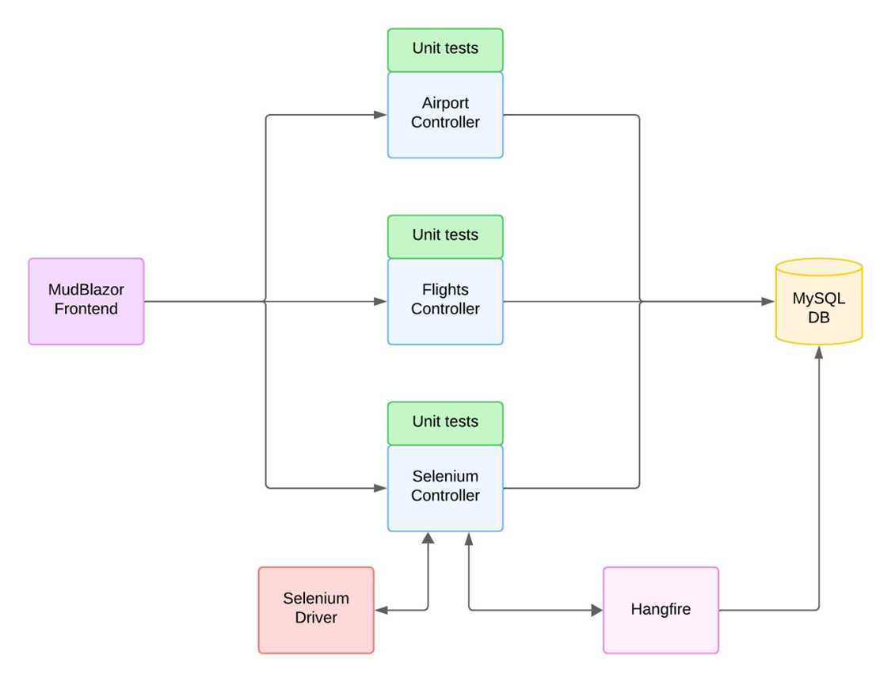

Overview:

Architecture:

Workflow:

1. Allow user to define interval (store to db)
2. User can set new trackable flight: Set Origin, Set Destination, Date and Time
	1. Fetch Data for the specified input => dont save anything to db yet => return the available flights to the user
	2. User selects the flight that he wants to track => save that flight to the db
3. Let magic (selenium) happen 
	1. User specified interval gets triggered
	2. Start background worker 
	3. Loop over flights in the db (on observe)
	4. Search for the flight on the specified interval
	5. If flight found (through selenium) get it's data and store to db
4. When flight(s) have been tracked, display that data for flight is available 
5. When the flight gets clicked, let the user make requests on the flight

---

airport data from: https://openflights.org/data

---

Setup:

1. Setup DB
	1. Docker "mysql:latest"
	2. ENV:
		* MYSQL_ROOT_PASSWORD
		* MYSQL_DATABASE
		* MYSQL_USER
		* MYSQL_PASSWORD
	3. Ports: 3306:3306
	4. Data: /my/own/datadir:/var/lib/mysql
2. Open .sln
	1. Install EF Core: dotnet tool install --global dotnet-ef
	2. Make migration in /Backend: dotnet ef migrations add InitialCreate
	3. Adjust connection string (from step 1.) in /Backend/appsettings.json and Frontend/appsettings.json
	4. Update db: dotnet ef database update
3. Start application
	* Backend
		* /swagger for api
		* /hangfire for job overview
	* Frontend
		* / for main-page

---

Test Flights

1. Zürich - Barcelona
	* Origin: 1678 (ZRH)
	* Destination: 1218 (BCN)
	* DateTime: 2025-06-11T15:30:00
	* FlightNumber: VY 6249
2. Barcelona - Zürich
	* Origin: 1218 (BCN)
	* Destination: 1678 (ZRH)
	* DateTime: 2025-06-15T15:30:00
	* FlightNumber: VY 6246

3. Zürich - Madrid
	* Origin: 1678 (ZRH)
	* Destination: 1229 (MAD)
	* DateTime: 2025-06-11T15:30:00
	* FlightNumber: IB 634

4. Madrid - Zürich
	* Origin: 1229 (MAD)
	* Destination: 1678 (ZRH)
	* DateTime: 2025-06-15T15:30:00
	* FlightNumber: IB 627