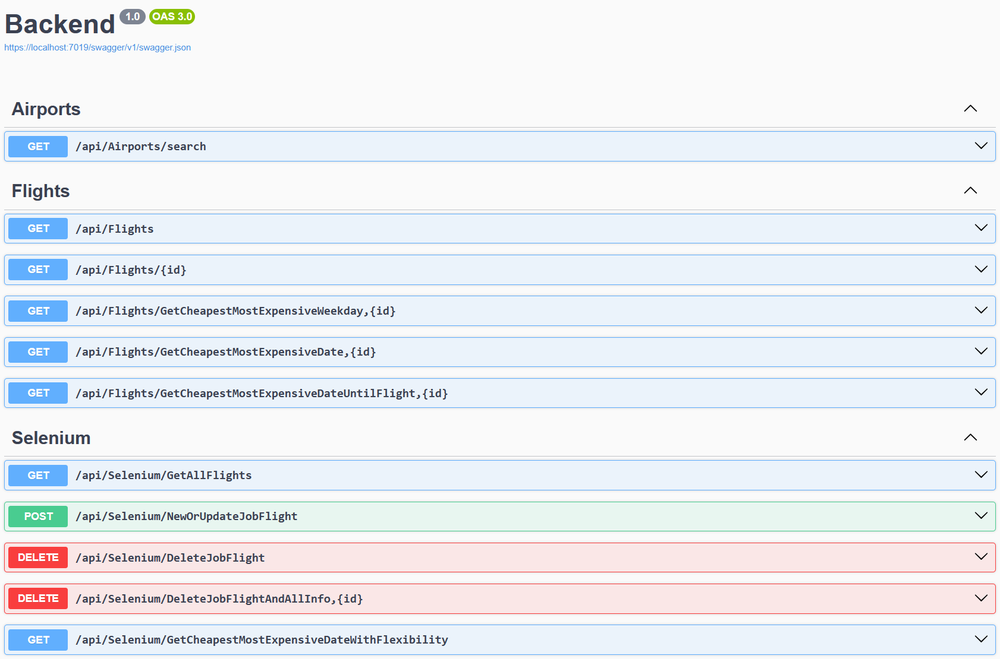
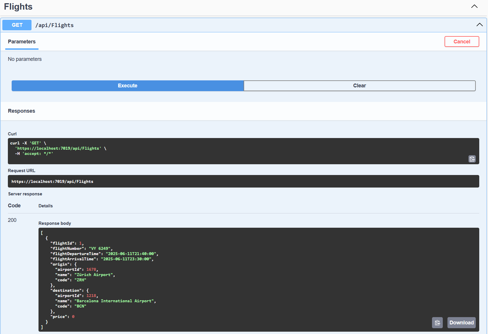
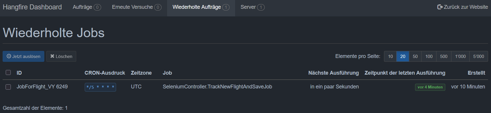
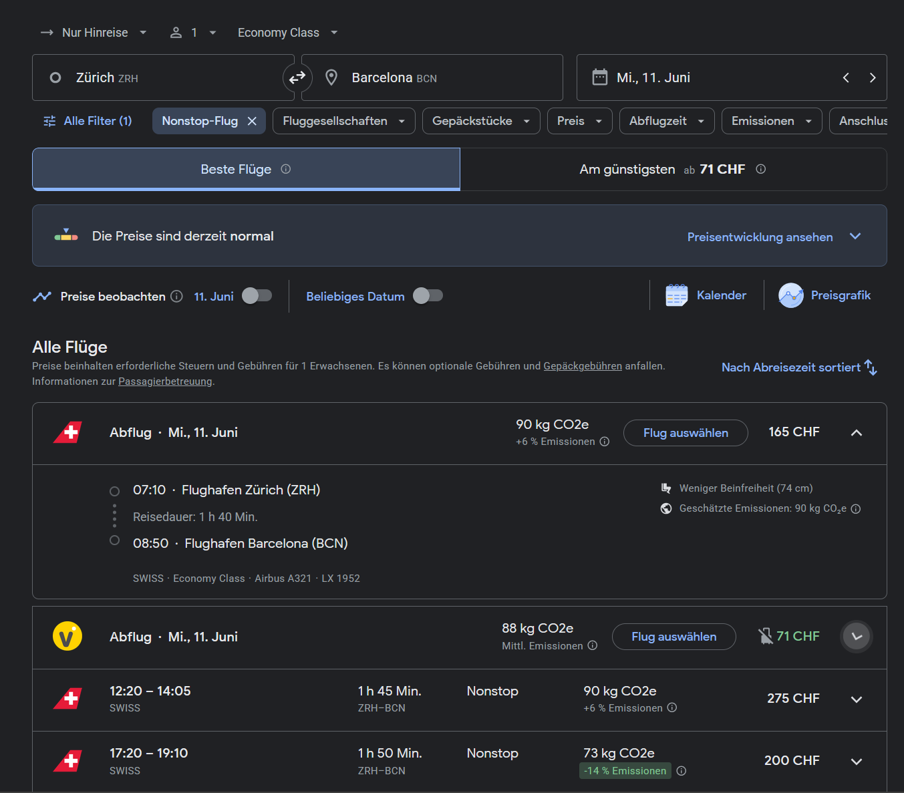
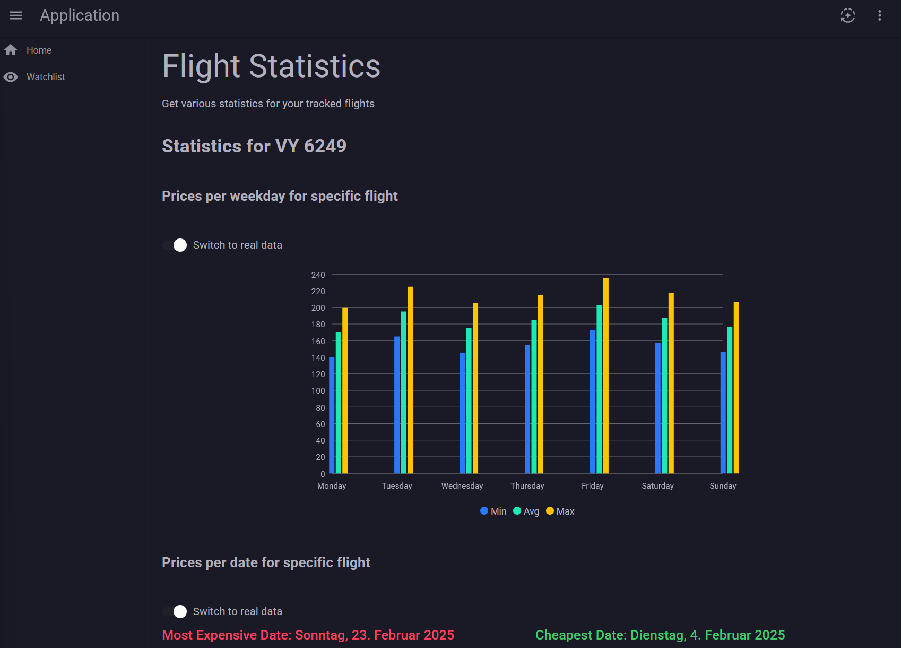

# Flight Tracker

## Overview
An application that allows users to track flights from Google Flights. The flight data is continuously scraped from Google Flights and stored in a MySQL database. After collecting sufficient data, users can analyze flight trends to:

* Determine the cheapest and most expensive weekdays to buy a ticket.
* Identify the cheapest and most expensive dates to purchase a ticket.
* Find the cheapest date to buy a ticket before departure.
* Analyze the cheapest and most expensive dates with flexibility (± some days before the actual flight).

Swagger API Documentation
* 
* 

Hangfire (Job Scheduling)



Frontend Interface


Architecture:


## Workflow

1. User Defines Tracking Interval
	* Store the tracking interval in the database.
2. User Sets a New Trackable Flight
	* Define Origin, Destination, Date, and Time.
	* Fetch available flights based on user input (without saving to the database yet).
	* User selects the flight they want to track, which is then stored in the database.
3. Flight Scraping Process (Using Selenium)
	* The user-specified interval triggers the tracking process.
	* A background worker starts.
	* The system loops over the flights stored in the database.
	* Searches for the flight at the defined interval.
	* If a flight is found via Selenium, its data is stored in the database.
4. Data Availability & Analysis
	* Once flights have been tracked, the data is available for display.
	* When a flight is selected, users can request detailed analysis.

## Data Source

* Airport data is sourced from: https://openflights.org/data

## Setup Instructions

1. Database Setup
	* Run MySQL in Docker: ```mysql:latest```
	* MySQL environment variables:
		* ```MYSQL_ROOT_PASSWORD```
		* ```MYSQL_DATABASE```
		* ```MYSQL_USER```
		* ```MYSQL_PASSWORD```
	3. Ports: ```3306:3306```
	4. Data: ```/my/own/datadir:/var/lib/mysql```
2. Backend Setup
	1. Open the ```.sln``` project file.
	2. Install EF Core: ```dotnet tool install --global dotnet-ef```
	3. Create a database migration in the /Backend directory: ```dotnet ef migrations add InitialCreate```
	4. Update the connection string in ```Backend/appsettings.json``` and ```Frontend/appsettings.json```.
	5. Apply database migrations: ```dotnet ef database update```
3. Start the Application
	* Run the backend and the frontend through Visual Studio
4. Access the Application
	1. Backend
		* Access API documentation: ```/swagger```
		* Access job overview: ```/hangfire```
	2. Frontend
		* Open the main page: ```/```

## Test Flights

1. Zürich - Barcelona
	* Origin: 1678 (ZRH)
	* Destination: 1218 (BCN)
	* DateTime: 2025-06-11T15:30:00
	* FlightNumber: VY 6249
2. Barcelona - Zürich
	* Origin: 1218 (BCN)
	* Destination: 1678 (ZRH)
	* DateTime: 2025-06-15T15:30:00
	* FlightNumber: VY 6246

3. Zürich - Madrid
	* Origin: 1678 (ZRH)
	* Destination: 1229 (MAD)
	* DateTime: 2025-06-11T15:30:00
	* FlightNumber: IB 634

4. Madrid - Zürich
	* Origin: 1229 (MAD)
	* Destination: 1678 (ZRH)
	* DateTime: 2025-06-15T15:30:00
	* FlightNumber: IB 627